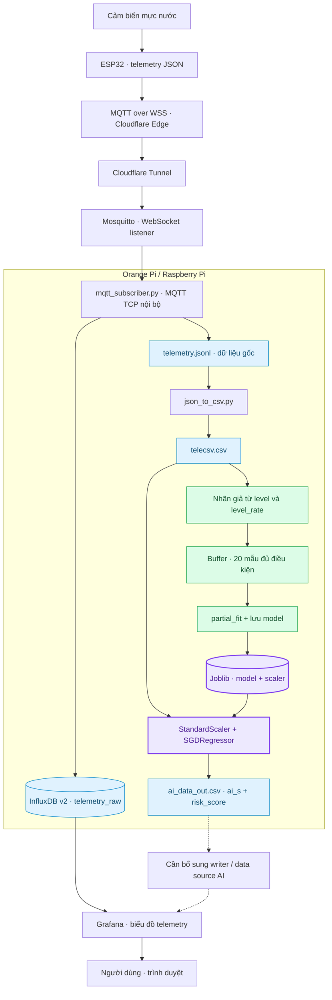
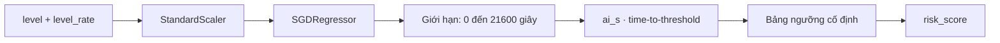
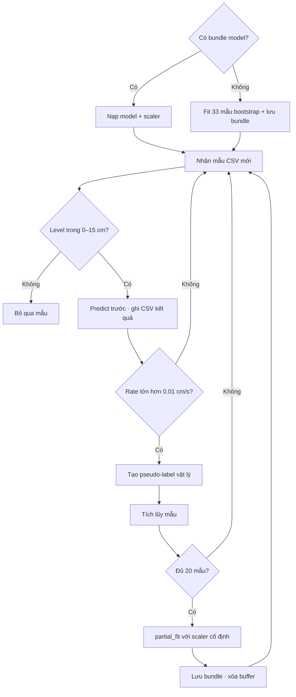

# Flood Risk Prediction with Online Learning
**Giám sát mực nước IoT và ước lượng thời gian chạm ngưỡng bằng học máy trực tuyến**

Hệ thống thu thập telemetry từ **ESP32 qua MQTT**, lưu dữ liệu **JSONL / CSV**, đưa số đo vào **InfluxDB** và hỗ trợ quan sát trên **Grafana**. Mô hình **SGDRegressor** ước lượng thời gian còn lại đến ngưỡng mực nước nguy hiểm và cập nhật dần bằng dữ liệu mới trên Orange Pi / Raspberry Pi.

> Điểm rủi ro là quy đổi theo ngưỡng thời gian; không phải xác suất xảy ra lũ đã được hiệu chuẩn.

## Tổng quan và mục tiêu

Một hệ thống giám sát cần quan sát cả mực nước hiện tại và tốc độ nước dâng. Dự án kết hợp pipeline IoT với mô hình hồi quy nhẹ để nghiên cứu cách ước lượng thời gian chạm ngưỡng, đồng thời cập nhật mô hình mà không huấn luyện lại toàn bộ từ đầu.

- Thu nhận và lưu dấu vết telemetry để theo dõi, phân tích và tái xử lý.
- Ước lượng thời gian đến ngưỡng từ hai biến: mực nước và tốc độ thay đổi.
- Kết hợp bootstrap training với online learning bằng nhãn giả vật lý.
- Triển khai xử lý trên máy tính nhúng; hỗ trợ truy cập từ xa theo kiến trúc Cloudflare Tunnel.
- Hiển thị số đo và phát triển cảnh báo dựa trên dữ liệu thời gian thực.

**Phạm vi hiện tại:** prototype với mực nước demo **0–15 cm**, ngưỡng **13 cm**. Repo có các script thu nhận, chuyển đổi và AI; cấu hình dịch vụ hạ tầng, firmware ESP32 và dashboard cần được triển khai riêng.

## Workflow tổng thể

Đường liền thể hiện pipeline được các script hỗ trợ. Đường nét đứt từ CSV dự đoán là phần tích hợp cần bổ sung.



## 5 technical cores

| Core | Thành phần | Vai trò |
|---|---|---|
| **1. IoT ingestion** | ESP32, MQTT, Mosquitto | Truyền và nhận telemetry theo topic |
| **2. Data pipeline** | JSONL, CSV, InfluxDB | Lưu dữ liệu gốc, chuẩn hóa cấu trúc và phục vụ truy vấn |
| **3. Time-to-threshold prediction** | StandardScaler + SGDRegressor | Ước lượng thời gian chạm ngưỡng |
| **4. Hybrid online learning** | Pseudo-label + partial_fit | Cập nhật mô hình theo batch nhỏ |
| **5. Monitoring & deployment** | Grafana, Orange Pi / Raspberry Pi, Cloudflare Tunnel | Quan sát số đo và triển khai từ xa |

## Dữ liệu và tiền xử lý

Topic mặc định: **12A09/raw/telemetry**. Payload tương thích với cấu hình demo:

```json
{
  "ts_ms": 1734500000000,
  "metrics": {
    "level": 10.0,
    "level_rate": 0.05
  }
}
```

| Trường | Ý nghĩa | Đơn vị |
|---|---|---|
| ts_ms | Unix timestamp của mẫu | Milliseconds |
| level | Chiều cao nước tính từ đáy trong mô hình demo | cm |
| level_rate | Tốc độ thay đổi mực nước; dương khi nước dâng | cm/s |
| ai_s | Thời gian do mô hình ước lượng đến ngưỡng | Giây |
| risk_score | Điểm quy đổi từ ai_s | Thang số 0–100 |

Subscriber lưu JSON object vào JSONL và ghi các field **level**, **level_rate** vào measurement **telemetry_raw** nếu đã cấu hình InfluxDB. Tag **station** lấy từ phần đầu topic; tag **device** lấy từ cấu hình.

Converter làm phẳng object **metrics**, chuyển số đo sang kiểu số và xuất CSV với header:

```text
ts,level,level_rate
```

Nếu có trường **ts**, converter giữ nguyên chuỗi này; nếu không, nó chuyển **ts_ms** sang thời gian local của máy chủ hoặc dùng thời gian hiện tại khi timestamp không hợp lệ. CSV không ghi timezone offset, vì vậy cần thống nhất múi giờ khi triển khai.

**Lưu ý:** các script Python nhận sẵn **level_rate** từ telemetry; repo chưa có firmware hoặc bước tính tốc độ từ chuỗi level. Đơn vị cm và cm/s phải thống nhất trước khi đưa vào AI.

## Kiến trúc AI



| Thành phần | Cấu hình trong mã nguồn |
|---|---|
| Features | level, level_rate |
| Scaler | StandardScaler; fit trên dữ liệu bootstrap, giữ cố định khi học online |
| Estimator | sklearn.linear_model.SGDRegressor |
| Loss / regularization | squared_error / L2, alpha = 0.0001 |
| Learning rate | invscaling, eta0 = 0.01 |
| Bootstrap fit | max_iter = 40000, tol = 0.0000000001, random_state = 42 |
| Dữ liệu bootstrap | 33 dòng nhúng trực tiếp trong train.py |
| Checkpoint | flood_ai_online_cm.joblib chứa model và scaler |
| Giới hạn đầu ra | 0–21600 giây, tương đương tối đa 6 giờ |

Nếu file Joblib tồn tại, script nạp bundle; chỉ bootstrap training khi chưa có file model. Dữ liệu **data/raw/water_level.csv** không được script này sử dụng để huấn luyện.

Với $h_t$ là level, $v_t$ là level_rate, vector đầu vào là:

$$\mathbf{x}_t=[h_t,v_t]^\top$$

Chuẩn hóa feature $j$ bằng thống kê bootstrap:

$$z_{t,j}=\frac{x_{t,j}-\mu_j}{s_j}$$

Trong đó $s_j$ là scale do StandardScaler lưu; với feature có phương sai bằng 0, scale được đặt bằng 1.

Mô hình hồi quy tuyến tính và đầu ra giới hạn:

$$\widetilde{T}_t=\mathbf{w}^{\top}\mathbf{z}_t+b$$

$$\widehat{T}_t=\min\left(T_{\max},\max\left(0,\widetilde{T}_t\right)\right)$$

$\widehat{T}_t$ tương ứng **ai_s**; $T_{\max}=21600$ giây. Đây là hồi quy thời gian chạm ngưỡng, chưa phải mô hình dự báo chuỗi mực nước nhiều bước.

## Hybrid online learning



Đặt $H=13$ cm là ngưỡng demo. Hàm tạo pseudo-label dùng giả định tốc độ nước dâng giữ nguyên:

$$y_t^{\mathrm{phys}}=\min\left(T_{\max},\max\left(0,\frac{H-h_t}{v_t}\right)\right),\qquad v_t>0$$

Trong hàm hiện tại, nếu $h_t\geq H$ thì nhãn bằng 0; nếu chưa chạm ngưỡng và $v_t\leq0$ thì nhãn bằng $T_{\max}$. Tuy nhiên, vòng học online chỉ nhận mẫu có $v_t>0.01$ cm/s.

Dạng mục tiêu squared error với L2 trên một batch gồm $B$ mẫu:

$$\mathcal{L}=\frac{1}{2B}\sum_{i=1}^{B}\left(\mathbf{w}^{\top}\mathbf{z}_i+b-y_i^{\mathrm{phys}}\right)^2+\frac{\alpha}{2}\sum_{j=1}^{2}w_j^2$$

SGD thực hiện cập nhật tăng dần qua **partial_fit**; mỗi lần đủ 20 mẫu hợp lệ, script cập nhật và lưu lại bundle. Scaler không được fit lại theo batch mới.

**Ý nghĩa của “hybrid”:** mô hình thống kê nhận tín hiệu dạy từ công thức vật lý đơn giản. Đây là **pseudo-label learning**, chưa có vòng phản hồi bằng thời điểm chạm ngưỡng quan sát thực tế. Online learning vì vậy không tự chứng minh chất lượng dự báo được cải thiện.

## Risk score

Hàm **risk_score** dùng các mức cố định sau, với $T=\widehat{T}_t$ tính bằng giây:

| Thời gian ước lượng | Điểm |
|---|---:|
| $T=0$ | 100 |
| $0<T\leq10$ | 95 |
| $10<T\leq30$ | 85 |
| $30<T\leq60$ | 75 |
| $60<T\leq120$ | 60 |
| $120<T\leq300$ | 45 |
| $300<T\leq900$ | 30 |
| $900<T\leq1800$ | 20 |
| $T>1800$ | 10 |

Mặc dù được mô tả trên thang 0–100, hàm hiện tại chỉ trả về các mức **10, 20, 30, 45, 60, 75, 85, 95, 100**. Đây là điểm phân tầng theo luật, không phải đầu ra xác suất của mô hình.

**Giới hạn cần biết:** đường dự đoán chưa ép ai_s về 0 khi level đã vượt 13 cm. Quy tắc này hiện chỉ có trong hàm tạo pseudo-label; cần bổ sung kiểm tra ngưỡng trực tiếp trước khi dùng cho cảnh báo.

## Hardware và tech stack

| Lớp | Công nghệ / vai trò |
|---|---|
| Sensor node | ESP32; phần chú thích AI đề cập JSN-SR04T cho demo |
| Edge host | Orange Pi / Raspberry Pi chạy Python và dịch vụ |
| Messaging | Mosquitto; MQTT TCP nội bộ, WSS cho luồng từ xa theo thiết kế |
| Data processing | Python 3.10+, NumPy, pandas |
| Machine learning | scikit-learn, Joblib |
| Time-series storage | InfluxDB v2, influxdb-client |
| Dashboard | Grafana |
| Remote access | Cloudflare Tunnel / cloudflared |

Inference và online learning chạy trên **máy tính nhúng**, chưa có TinyML inference trên ESP32 trong repo. Firmware, sơ đồ đấu nối, cấu hình Mosquitto/Tunnel và dashboard Grafana chưa được cung cấp trong cây thư mục hiện tại.

## Cấu trúc repository

```text
.
├── README.md
├── .gitignore
└── 12A09/
    ├── mqtt-code/
    │   ├── subscriber/
    │   │   ├── mqtt_subscriber.py
    │   │   └── .env.example
    │   ├── json_to_csv.py
    │   ├── ai/
    │   │   ├── train.py
    │   │   └── models/flood_ai_online_cm.joblib
    │   ├── data/raw/water_level.csv
    │   ├── telecsv.csv
    │   └── requirements.txt
    └── mqtt-data/
        ├── raw/
        │   ├── telemetry.jsonl
        │   ├── telecsv.csv
        │   └── tele-sim.jsonl
        └── processed/ai_data_out.csv
```

Input mặc định của AI là **12A09/mqtt-data/raw/telecsv.csv**, không phải file cùng tên trong **mqtt-code**. Output gồm **ts, level, level_rate, ai_s, risk_score**.

## Cài đặt và chạy

Các lệnh dưới đây dùng Bash trên Linux / Orange Pi / Raspberry Pi và chạy từ root repository. Mosquitto phải được cài và chạy riêng; InfluxDB/Grafana chỉ cần cho nhánh dashboard.

**1. Chuẩn bị Python**

```bash
git clone https://github.com/miyuzu-dev/FLOOD-RISK-PREDICTION-WITH-ONLINE-LEARNING.git
cd FLOOD-RISK-PREDICTION-WITH-ONLINE-LEARNING
python3 -m venv .venv
source .venv/bin/activate
python3 -m pip install -r 12A09/mqtt-code/requirements.txt
```

Dependencies hiện chưa ghim phiên bản. Bundle Joblib cần môi trường scikit-learn tương thích; nếu gặp lỗi phiên bản, dùng model mới qua MODEL_PATH để bootstrap lại. Chỉ nạp bundle từ nguồn tin cậy.

**2. Cấu hình subscriber**

```bash
cp 12A09/mqtt-code/subscriber/.env.example 12A09/mqtt-code/subscriber/.env
```

Sửa file **.env** bằng cấu hình của bạn. Nếu chỉ cần JSONL, để **INFLUX_TOKEN=** trống. Script không tự đọc .env; nạp vào shell trước khi chạy:

```bash
set -a
source 12A09/mqtt-code/subscriber/.env
set +a
python3 12A09/mqtt-code/subscriber/mqtt_subscriber.py
```

**3. Chạy converter và AI trong hai terminal riêng**, đều kích hoạt cùng môi trường Python và đứng tại root repo:

```bash
python3 12A09/mqtt-code/json_to_csv.py
```

```bash
python3 12A09/mqtt-code/ai/train.py
```

Converter mặc định chỉ nhận dòng mới sau khi khởi động. AI dự đoán lại dữ liệu CSV đang có, ghi đè file output, rồi theo dõi dòng mới. Các dòng lịch sử được export không tham gia vòng partial_fit này.

**4. Kiểm tra luồng local** — khi ba tiến trình đã sẵn sàng, gửi một mẫu thử bằng Mosquitto client:

```bash
mosquitto_pub -h 127.0.0.1 -p 1883 \
  -t 12A09/raw/telemetry \
  -m '{"metrics":{"level":10.0,"level_rate":0.05}}'
tail -n 5 12A09/mqtt-data/processed/ai_data_out.csv
```

Mẫu thử bỏ timestamp để pipeline dùng thời gian máy chủ. Khi vận hành, thiết bị nên gửi **ts_ms** hợp lệ. Repo có sẵn dữ liệu mẫu, nên kiểm tra timestamp và dòng mới thay vì chỉ kiểm tra file có tồn tại.

## Cấu hình vận hành

| Biến / tham số | Mặc định | Áp dụng |
|---|---|---|
| MQTT_HOST / MQTT_PORT | 127.0.0.1 / 1883 | Subscriber, MQTT TCP |
| MQTT_TOPIC | 12A09/raw/telemetry | Subscriber |
| INFLUX_URL | http://127.0.0.1:8086 | Subscriber |
| INFLUX_ORG / INFLUX_BUCKET | mworkste / 12A09 | Subscriber |
| INFLUX_TOKEN | Trống | Không ghi InfluxDB khi chưa có token |
| INFLUX_MEAS_RAW | telemetry_raw | Measurement |
| STATION_ID / DEVICE_ID | 12A09 / esp32 | Station dự phòng / device tag |
| RECONNECT_SLEEP | 2 giây | Subscriber thử kết nối lại |
| JSONL_PATH | mqtt-data/raw/telemetry.jsonl dưới 12A09 | Override chỉ được subscriber hỗ trợ |
| TELECSV_PATH / OUT_PATH / MODEL_PATH | Các đường dẫn trong sơ đồ thư mục | Override cho AI |
| START_FROM_BEGIN | 0 | Converter; đặt 1 để đọc từ đầu |
| RESET_CSV | 0 | Converter; đặt 1 sẽ xóa CSV cũ |

Converter dùng đường dẫn cố định từ vị trí script, nên đổi JSONL_PATH ở subscriber phải đồng thời điều chỉnh converter. Ngưỡng 13 cm, range 0–15 cm và batch 20 nằm trong **train.py**, chưa phải biến môi trường.

Đọc lại JSONL từ đầu sẽ append vào CSV hiện có và có thể tạo bản ghi trùng. RESET_CSV xóa CSV đích; chỉ dùng sau khi sao lưu và dừng các tiến trình phụ thuộc.

## Cloudflare Tunnel, InfluxDB và Grafana

Theo thiết kế triển khai, ESP32 kết nối WSS đến hostname của bạn; cloudflared chuyển tiếp vào WebSocket listener của Mosquitto, dự kiến cổng **9001**. Subscriber Python kết nối **MQTT TCP cổng 1883**, không trực tiếp dùng WSS.

Cần cấu hình DNS, tunnel, WebSocket listener và quyền truy cập broker riêng. Subscriber hiện chưa có thiết lập username/password hoặc TLS trong mã; cần hoàn thiện trước khi mở hệ thống ra ngoài môi trường thử nghiệm.

Trong Grafana, thêm data source InfluxDB v2 và truy vấn measurement **telemetry_raw**, fields **level** và **level_rate**. Các trường **ai_s** và **risk_score** mới được xuất CSV; cần bổ sung writer sang InfluxDB hoặc data source phù hợp để hiển thị chúng. Repo chưa cung cấp dashboard hay alert rule có thể import.

## Kiểm thử và giới hạn hiện tại

Repo chưa có bộ kiểm thử tự động hoặc báo cáo đánh giá trên tập dữ liệu độc lập. Kết quả CSV hiện có không đủ để kết luận độ chính xác.

- **Mô hình tuyến tính:** quan hệ thời gian chạm ngưỡng theo tốc độ là phi tuyến; cần so sánh trực tiếp với baseline vật lý.
- **Pseudo-label:** giả định tốc độ giữ nguyên, chưa sử dụng quan trắc lũ thực làm ground truth.
- **Ngưỡng demo:** 13 cm và range 0–15 cm không thể áp dụng nguyên trạng cho sông, kênh hoặc khu vực ngập thực tế.
- **Kiểm tra dữ liệu:** guard range chỉ có ở luồng mẫu mới; export lịch sử xử lý khác. Kiểm tra NaN/Inf, timestamp và giá trị ngoại lệ cần được thống nhất.
- **Độ bền pipeline:** subscriber dùng QoS 0; các file follower chưa có checkpoint, xử lý rotation và cơ chế chống trùng đầy đủ.
- **Lưu trạng thái:** mỗi lần chạy AI ghi đè output; model chỉ được lưu sau batch đủ 20 mẫu, buffer chưa đủ batch không được lưu khi dừng.
- **Cảnh báo:** chưa có kiểm tra vượt ngưỡng độc lập, đánh giá độ trễ cảnh báo hoặc cơ chế xác nhận sự kiện.

Kế hoạch đánh giá nên chia train/test theo thời gian, đo MAE/RMSE trên thời điểm chạm ngưỡng thực, đo cảnh báo sai/bỏ sót và so sánh **physics baseline**, **SGD cố định**, **SGD online**. Các trường hợp chưa chạm ngưỡng trong thời gian quan sát cần xử lý riêng, không coi 21600 giây là thời điểm thực.

## Disclaimer

Đây là prototype nghiên cứu IoT và online learning. **Thời gian chạm ngưỡng ước lượng không đồng nghĩa với dự báo lũ đã được kiểm chứng.** Hệ thống chưa được xác nhận cho vận hành cảnh báo thiên tai và không nên là nguồn duy nhất cho quyết định an toàn hoặc sơ tán.
